# Improved Fraud Detection for E-commerce and Banking

This project, developed for Adey Innovations Inc., aims to build and evaluate robust machine learning models to detect fraudulent transactions in two distinct domains: e-commerce purchases and bank credit card transactions. The primary goal is to accurately identify fraudulent activity while minimizing the disruption to legitimate users, balancing the trade-off between security and user experience.

## Project Status

**Current Stage**: Task 2: Model Building and Evaluation - Complete.
- Data preprocessing and feature engineering are complete.
- Two models (Logistic Regression and LightGBM) have been trained and evaluated on both datasets.
- Initial model selection has been performed based on performance metrics.

## Project Structure

The repository is organized to ensure clarity, reproducibility, and scalability:

```
.
├── data/
│   ├── 01_raw/         # Original, immutable datasets
│   └── ...
├── models/             # Saved (serialized) trained model pipelines
├── notebooks/          # Jupyter notebooks for analysis and modeling
│   ├── 01_ecommerce_eda_and_preprocessing.ipynb
│   ├── 02_creditcard_eda_and_preprocessing.ipynb
│   └── 03_modelling_and_evaluation.ipynb
├── reports/
│   ├── figures/        # Saved plots and charts
│   └── ...
├── src/                # (Future) For reusable Python functions
└── requirements.txt    # Project dependencies
```

## Setup and Installation

To replicate the analysis, please follow these steps:

**Clone the repository:**
```bash
git clone https://github.com/Eyoab11/Fraud-Detection-System>
cd Fraud-Detection-System
```

**Create and activate a virtual environment:**
```bash
python -m venv venv
# On Windows
.\venv\Scripts\Activate
# On macOS/Linux
source venv/bin/activate
```

**Install the required dependencies:**
```bash
pip install -r requirements.txt
```

## Methodology

### 1. Data Preprocessing and Feature Engineering (Task 1)

**Data Cleaning**: Duplicate entries were identified and removed from both Fraud_Data.csv and creditcard.csv.

**Feature Engineering**: For the e-commerce dataset, a new feature `time_since_signup` was engineered by calculating the seconds between user signup and purchase time. This proved to be a highly predictive feature.

**Geolocation Analysis**: An attempt was made to map IP addresses to countries. However, investigation revealed that the numerical IP addresses in Fraud_Data.csv were incompatible with the ranges provided in IpAddress_to_Country.csv. This feature was therefore abandoned due to data quality issues.

### 2. Modeling Pipeline (Task 2)

A robust and reusable modeling pipeline was constructed to ensure consistency and prevent data leakage. The key steps are:

**Preprocessing**: A ColumnTransformer was used to apply StandardScaler to all numerical features and OneHotEncoder to categorical features.

**Imbalance Handling**: The SMOTE (Synthetic Minority Over-sampling Technique) was integrated into the pipeline to oversample the minority (fraud) class. This was applied only to the training data to ensure an unbiased evaluation on the test set.

**Model Training**: Two models were evaluated: a LogisticRegression baseline and a powerful LightGBM ensemble model.

## Performance Results

The models were evaluated using metrics appropriate for imbalanced classification: F1-Score and AUC-PR (Average Precision), with a focus on the 'Fraud' class.

| Dataset | Model | F1-Score (Fraud) | AUC-PR | Recall (Fraud) | Precision (Fraud) | False Positives |
|---------|-------|------------------|--------|----------------|-------------------|-----------------|
| E-commerce | Logistic Regression | 0.27 | 0.45 | 0.69 | 0.17 | 9844 |
| E-commerce | LightGBM | 0.69 | 0.62 | 0.53 | 1.00 | 1 |
| Credit Card | Logistic Regression | 0.10 | 0.67 | 0.87 | 0.05 | 1490 |
| Credit Card | LightGBM | 0.66 | 0.75 | 0.82 | 0.56 | 62 |

## Analysis of Results

**E-commerce Data**: The Logistic Regression model achieved high recall (catching 69% of fraud) but at a disastrous cost to precision, resulting in 9,844 false positives. The LightGBM model, while catching slightly less fraud (53% recall), had near-perfect precision, producing only 1 false positive. This makes it vastly superior from a user experience perspective.

**Credit Card Data**: This dataset's extreme imbalance proved very challenging. The Logistic Regression model again achieved high recall (87%) but was almost always wrong, flagging 1,490 legitimate transactions incorrectly. The LightGBM model provided a much better balance, catching a high percentage of fraud (82% recall) while drastically reducing false positives to just 62.

## Model Selection Justification

Based on the evaluation across both datasets, the LightGBM model is the clear winner.

**Justification:**
- **Superior Balance**: LightGBM consistently provides a much better balance between Precision and Recall, as evidenced by its significantly higher F1-Scores.
- **Business Impact**: A key challenge is minimizing False Positives to avoid alienating customers. LightGBM reduced false positives by over 99% compared to the baseline in both scenarios, making it a far more practical and business-friendly solution.
- **Robustness**: It performed exceptionally well even on the highly imbalanced and anonymized credit card dataset, demonstrating its ability to capture complex patterns.

## Next Steps

The next phase of this project will focus on **Task 3: Model Explainability**. We will use the SHAP (SHapley Additive exPlanations) library to interpret the decisions of our best-performing LightGBM models. This will help us understand the key drivers of fraud and build trust in the model's predictions.

## Exploratory Data Analysis (EDA)

Key findings and visualizations:

### E-commerce Data

- **Class Imbalance**: Only ~9% of transactions are fraudulent.
  - 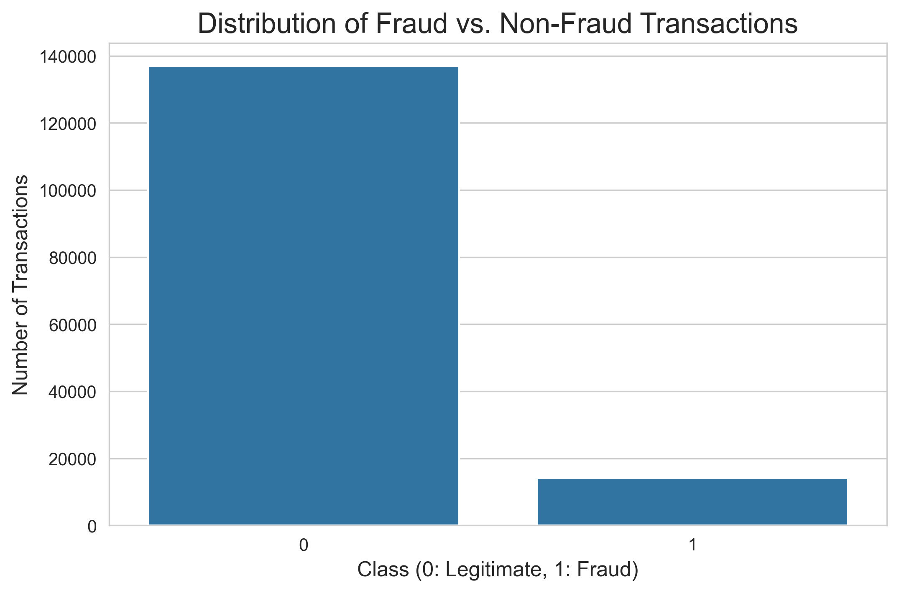
- **Time Since Signup**: Fraudulent users tend to purchase sooner after signup.
  - 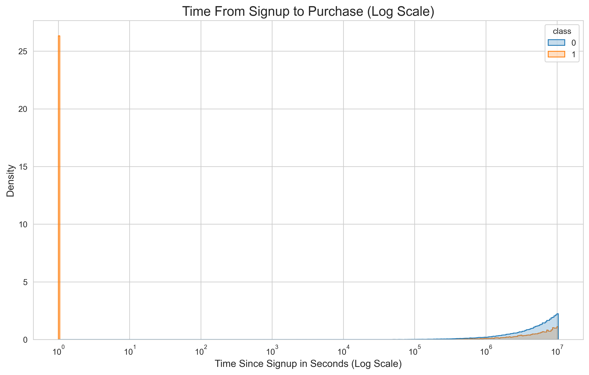
- **Purchase Value**: Fraudulent transactions often have higher purchase values.
  - 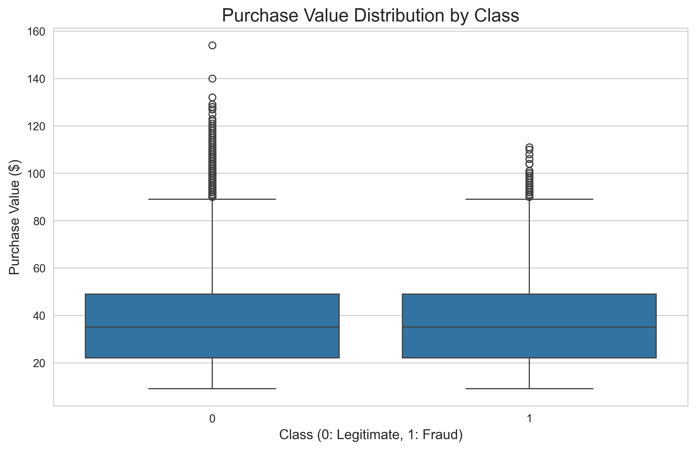
- **Fraud Rate by Categorical Features**:
  - By browser: 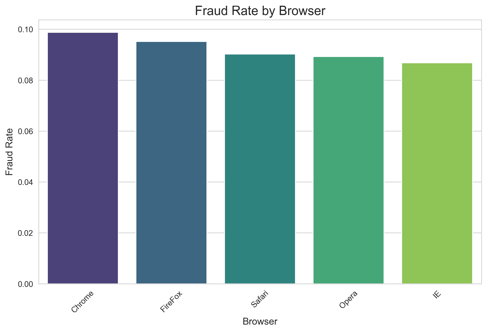
  - By source: 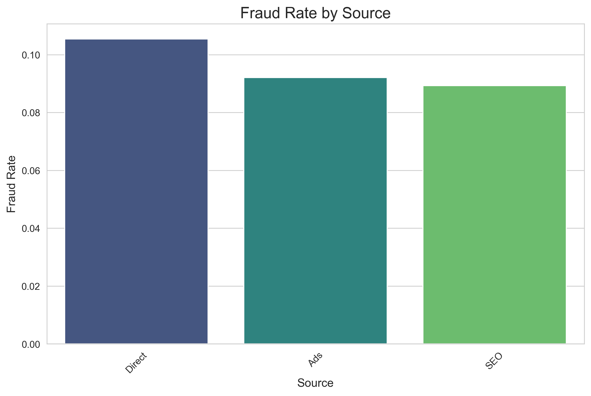
  - By sex: 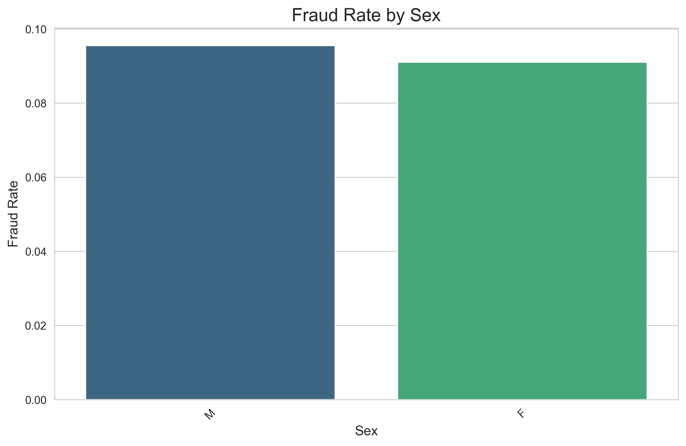

### Credit Card Data

- **Class Imbalance**: Only ~0.17% of transactions are fraudulent.
  - 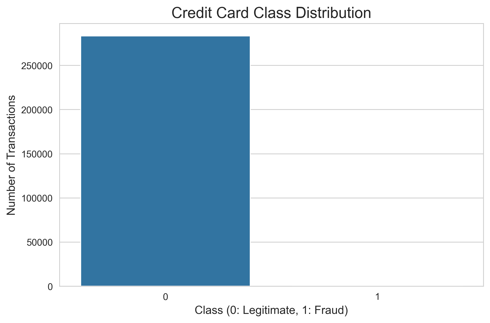
- **Transaction Amount**: Fraudulent transactions show distinct amount patterns.
  - 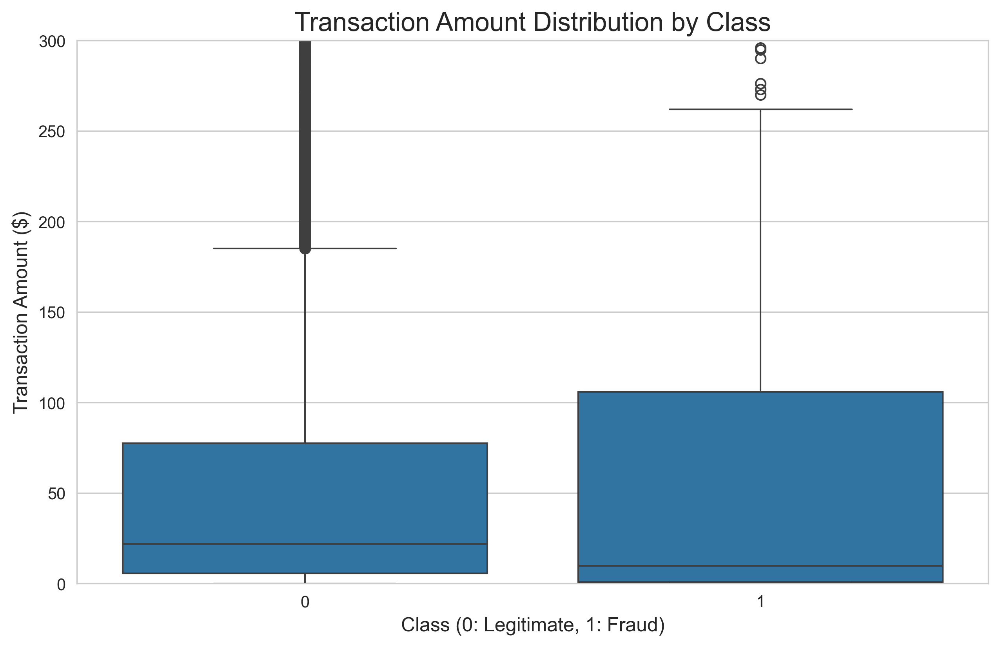
- **Anonymized Features**: Certain features (V10, V12, V14, V17) show different distributions for fraud vs. non-fraud.
  - 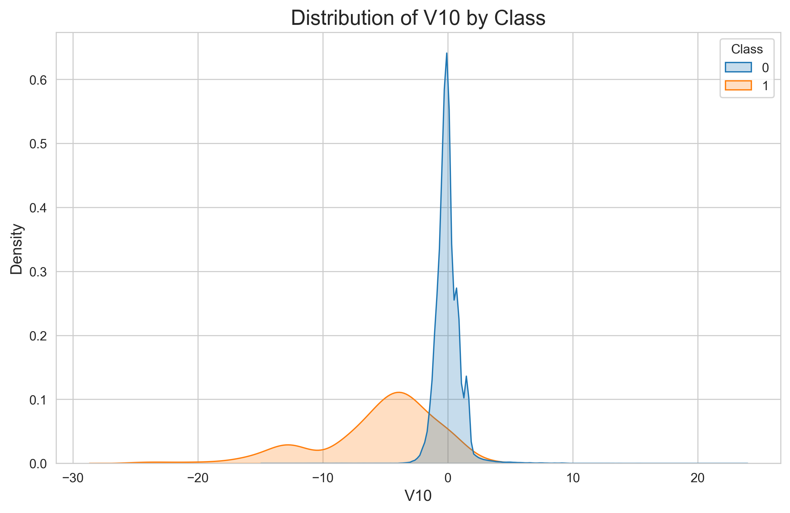
  - 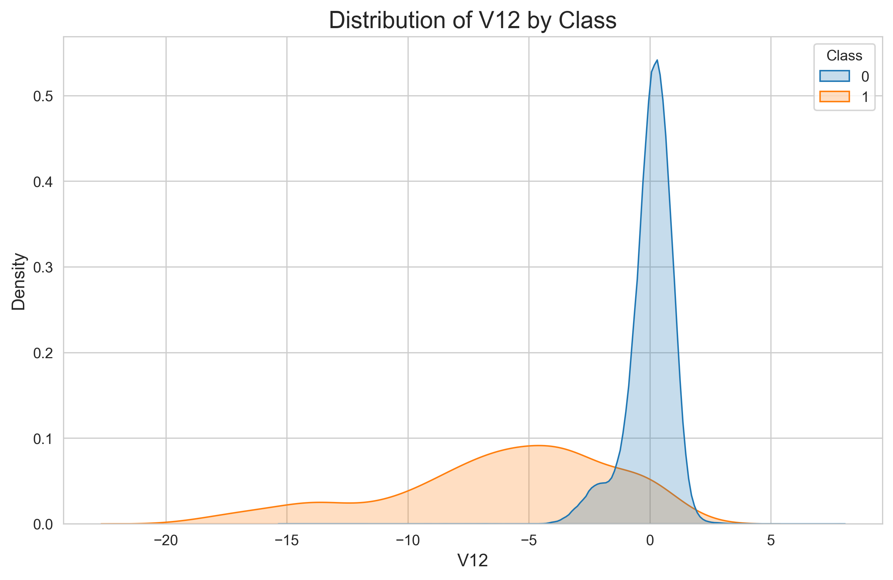
  - 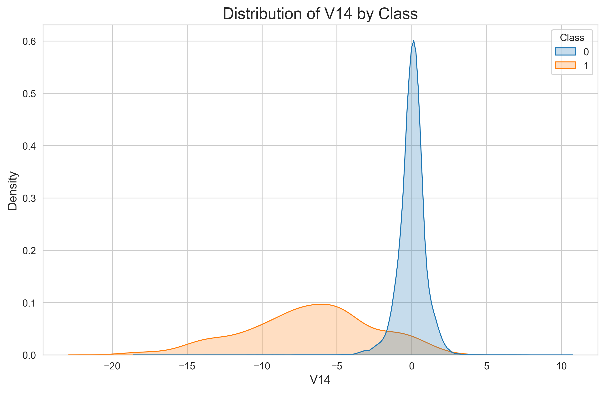
  - 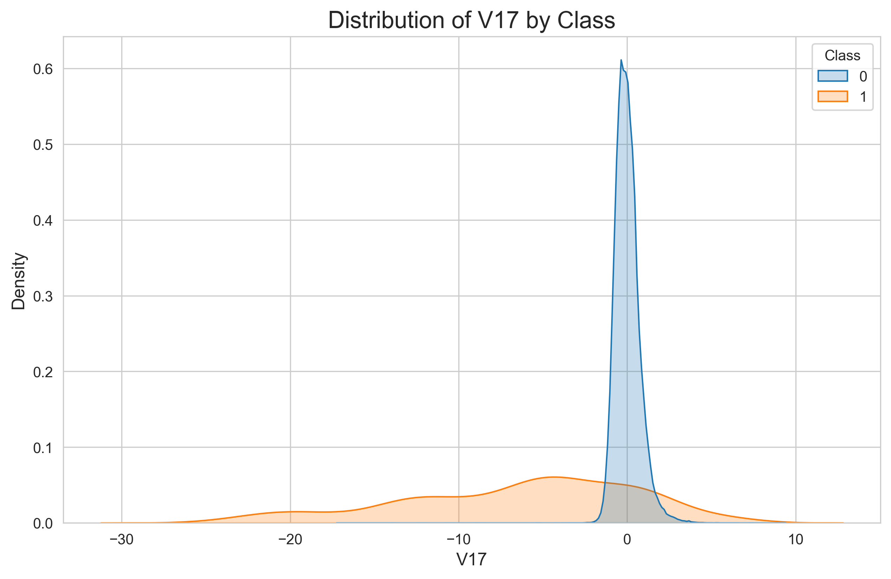

## Getting Started

1. **Clone the repository** and set up a virtual environment.
2. **Install dependencies**:
   ```
   pip install -r requirements.txt
   ```
3. **Run the notebooks** in the `notebooks/` directory to reproduce the analysis and figures.

## Acknowledgements

- Datasets sourced from public repositories for educational purposes.
- Visualizations generated using Matplotlib and Seaborn.
- Project developed for Adey Innovations Inc.

# Task 3: Model Explainability with SHAP

To understand the decision-making process of the best-performing LightGBM models, we used the SHAP (SHapley Additive exPlanations) library. This allows us to interpret both the global feature importance across all predictions and the local feature contributions for individual transactions.

## 1. E-commerce Fraud Model Interpretation

*(Note: This section is based on the previous plots you shared for the e-commerce model)*

The SHAP analysis reveals that the model's predictions are dominated by a few key features:

- **Global Importance**:  
  The summary plot shows that `time_since_signup` is by far the most influential feature. Low values for this feature (meaning a purchase happened very soon after signup) strongly push the prediction towards "Fraud". `age` and `purchase_value` also have a noticeable impact, while categorical features like `browser` and `source` are less important.

- **Local Prediction**:  
  The force plot for a single fraudulent transaction confirms this. The prediction was driven almost entirely by an extremely low `time_since_signup` value, which overpowered all other features.

## 2. Credit Card Fraud Model Interpretation

The SHAP analysis for the credit card dataset provides valuable insights into the anonymized features.

### Global Feature Importance

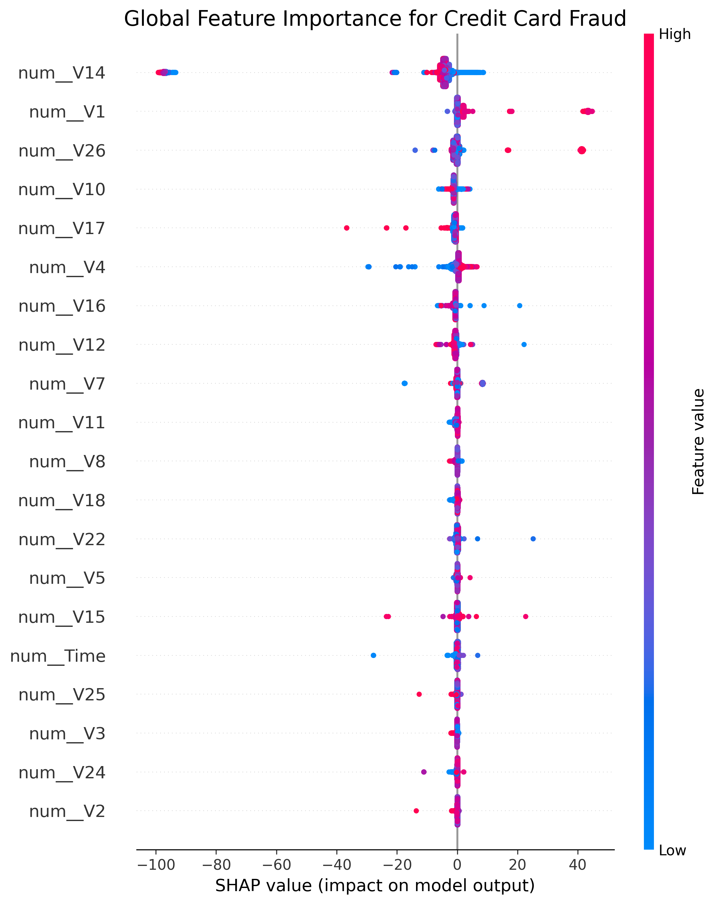

**Key Drivers of Fraud**:  
The summary plot clearly identifies a hierarchy of feature importance. The most significant features driving the model's predictions are:
- `num__V14`
- `num__V1`
- `num__V26`
- `num__V10`
- `num__V17`

**How Features Impact Predictions**:
- `num__V14`: This is the most powerful predictor. Low values of V14 (blue dots) have a very high positive SHAP value, meaning they are a strong indicator of fraud.
- `num__V17`: Similar to V14, low values of V17 also strongly push the prediction towards fraud.
- `num__V4`: This feature works in the opposite direction. High values of V4 (red dots) have a positive SHAP value, indicating that a higher V4 value is associated with fraud.

Even without knowing the original meaning of these PCA components, SHAP allows us to understand which underlying data patterns are most critical for fraud detection.

### Local Prediction Explanation


*(Note: This assumes you have saved a screenshot of the force plot to this location)*

The force plot above explains the prediction for a single transaction that was correctly identified as fraudulent.

- **Compounding Factors**:  
  Unlike the e-commerce model, this prediction was not driven by a single feature. Instead, it was the result of multiple features all pushing the prediction higher (towards fraud).

- **Contributing Features**:  
  The red arrows show that low values for `V17`, `V12`, `V14`, `V10`, and `V25`, along with a high value for `V4`, all contributed to increasing the fraud score.

- **Counteracting Features**:  
  A few features, notably `V8` and `V16`, pushed the prediction lower (towards legitimate), but their combined effect was not strong enough to overcome the evidence from the fraud-indicating features.

## Conclusion from Task 3

Model explainability using SHAP has been highly successful. We have moved beyond simply knowing that a model works and can now explain why it works. We have identified the specific features that are the most powerful indicators of fraud in both datasets, providing actionable insights that can be used to improve fraud detection strategies and build trust with stakeholders.
